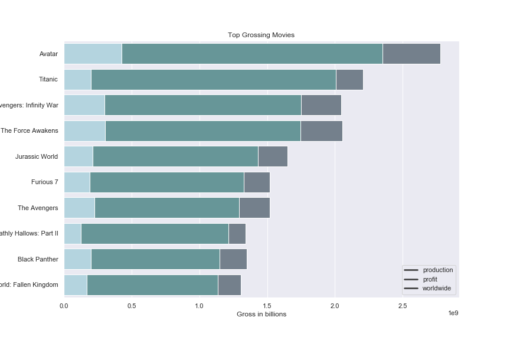
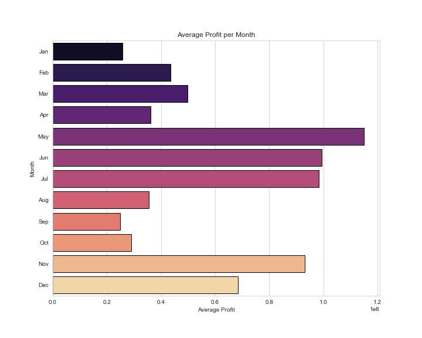

# Project description

Analyzing movie data to help Microsoft's new buisness plan to make a new movie studio

## Data

Data from three different sources

1. IMDB
    1. imdb.title.basics
    2. imdb.title.ratings
2. The Numbers
    1. tn.movie_budgets
3. Box Office Mojo
    1. bom.movie_gross

### The Project

Microsoft sees all the big companies creating original video content and they want to get in on the fun. They have decided to create a new movie studio, but they don’t know anything about creating movies. You are charged with exploring what types of films are currently doing the best at the box office. You must then translate those findings into actionable insights that the head of Microsoft's new movie studio can use to help decide what type of films to create.

### My Findings

### Question 1:  What are the highest rated genres?
    

The "Top Rated Genres" chart shows that the Biography genre is the highest rated
with an average rating of a little over 7 stars


## Question 2  

 **What are the most profitable movies?**

Below is the Top Grossing Movies bargraph.  It shows the production budget, profits, and worldwide gross.
with the top 3 movies bringing in a profit of over 1 billion dollars.



## Question 3:  When would be the best time to release a movie? 

the chart shows the Average profit for each month thoughout the year.
based on the chart it looks like that the best time to release a movie would
be in the summer months of May, June, and July.  Try to avoid releasing a movie 
the beginning of the year.



# Conclusion 

**Here are my recommendations:**

1. For better ratings i would look into focusing on the the top genres: Biography, Adventure
and Action.
2. Movies released in the summer months are more profitable so i would focus on aiming your release date
around that time.  Avoid releasing a movie at the start of the year
3. See what kind of movies the top profiting ones are like what genre are they, what studio is producing them 
and based off of that you can get an idea of where to start with a movie.


```python

```
